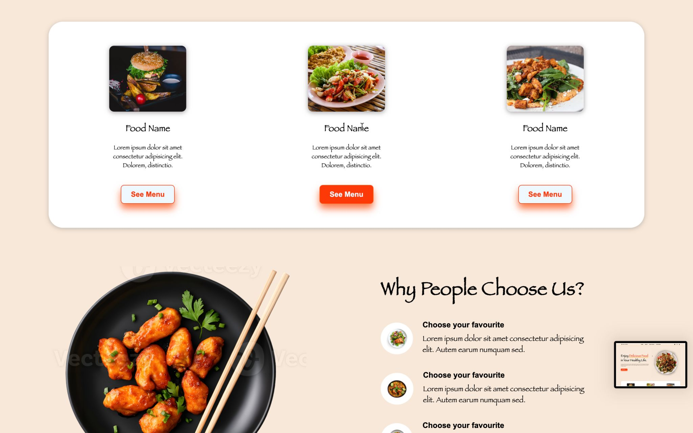
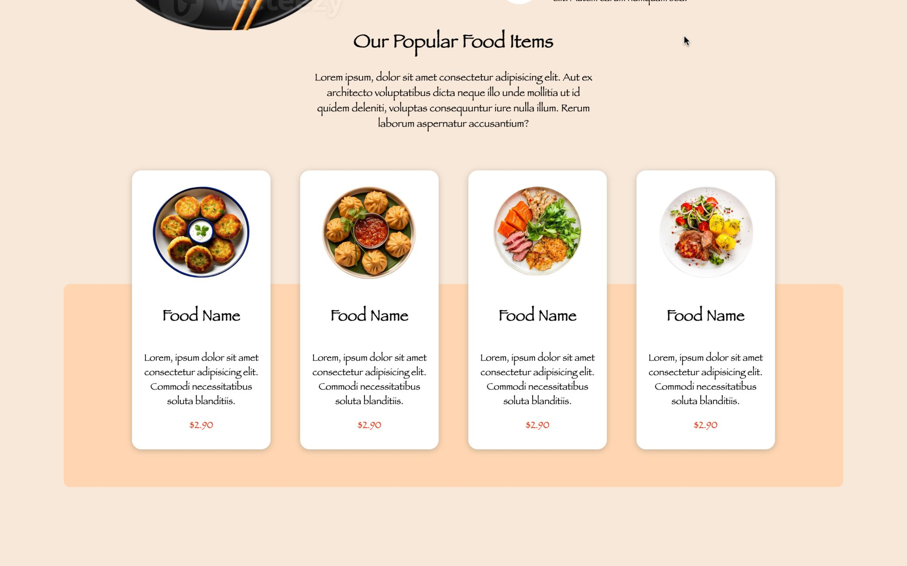
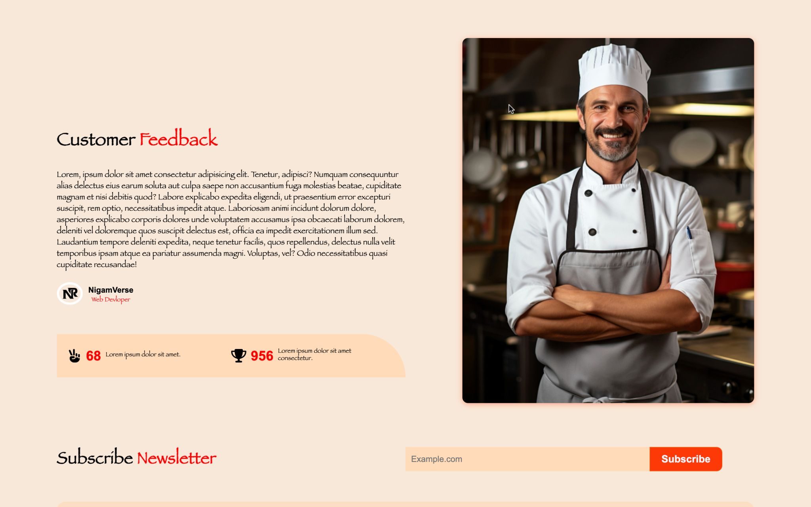

# 🍽️ Restaurant Website Project

A modern and responsive **Restaurant Website** built with **HTML &
CSS**.\
The project includes beautiful animations, hover effects, and a
user-friendly design.

------------------------------------------------------------------------

## 🚀 Features

-   Fully responsive design for all devices.
-   Smooth animations and hover effects.
-   Mobile navigation with overlay menu.
-   Sections: Home, Menu, About, Offers, Contact.
-   Clean and simple UI with modern look.

------------------------------------------------------------------------

## 🛠️ Tech Stack

-   **HTML5**
-   **CSS3** (with animations & transitions)
-   **Google Fonts**

------------------------------------------------------------------------

## 📂 Project Structure

    ├── index.html      # Main file
    ├── style.css       # Styling file
    ├── images/         # Images and icons
    └── README.md       # Project documentation

------------------------------------------------------------------------

## 📸 Screenshots

### 🏠 Home Page

### 📋 Menu Section

### ℹ️ About Section

### 📩 Customer Feedback

------------------------------------------------------------------------

## 💻 Setup & Usage

1.  Clone or download this repository.
2.  Open `index.html` in your browser.
3.  Explore the restaurant website with animations & effects!

------------------------------------------------------------------------

## 📧 Author

**Your Name**\
📩 Email: nigamrathore123456@gmail.com\
🌐 Linkedin: www.linkedin.com/in/nigam-rathore\

------------------------------------------------------------------------

⭐ If you like this project, give it a star on GitHub!
